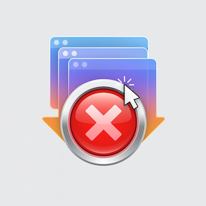

# QuitAll

<div align="center">



**A simple, elegant macOS menu bar utility to quit all running applications at once.**

[](https://www.apple.com/macos/)
[](https://swift.org)
[](LICENSE)
[](https://github.com/lmquang/QuitAll/releases)

[Features](#features) • [Installation](#installation) • [Usage](#usage) • [Building](#building-from-source) • [Contributing](#contributing) • [Support](#support)

</div>

---

## Overview

QuitAll is a lightweight macOS menu bar application that helps you quickly quit all running applications with a single click. Perfect for:

- 🧹 **Cleaning up** your workspace at the end of the day
- 🔄 **Switching contexts** between work and personal projects
- ⚡ **Performance boost** by closing unnecessary apps
- 🔒 **Privacy** - quickly close all apps before stepping away

Built with a modern Swift/SwiftUI architecture, QuitAll is fast, secure, and respects your system's integrity by protecting critical macOS components.

## Features

### 🎯 Core Features

- **One-Click Quit All** - Close all applications instantly from the menu bar
- **Smart Whitelist** - Protect specific apps from being quit
  - Persistent whitelist (saved across sessions)
  - Temporary whitelist (current session only)
- **System Protection** - Automatically protects critical macOS apps (Finder, Dock, etc.)
- **Real-Time Updates** - App list refreshes automatically as apps launch or quit
- **Native Integration** - Seamlessly integrates with macOS menu bar
- **Graceful Quitting** - Apps are given time to save work before force quit
- **Error Handling** - Clear feedback when apps refuse to quit

### 🛡️ Safety Features

- **Protected System Apps** - Cannot quit Finder, Dock, SystemUIServer, and other critical components
- **Self-Protection** - QuitAll will never quit itself
- **Confirmation Dialog** - Optional confirmation before quitting all apps (configurable)
- **Graceful Shutdown** - Apps get 5 seconds to quit gracefully before force quit

### 🎨 User Experience

- **Menu Bar Only** - No Dock icon, stays out of your way
- **Dark/Light Mode** - Automatically adapts to your system theme
- **Minimal Memory** - Uses <50MB of RAM when active, <20MB when idle
- **Fast Performance** - <3% CPU usage during operation
- **Clean Interface** - Simple, intuitive SwiftUI design

## Screenshots

### Main Interface

*Clean list of running applications with whitelist toggles*

### Settings View

*Configure persistent whitelist and preferences*

### Menu Bar Integration

*Seamless macOS menu bar integration*

## Installation

### Download Pre-built Binary (Recommended)

1. Download the latest release from [Releases](https://github.com/lmquang/QuitAll/releases)
2. Unzip the downloaded file
3. Move `QuitAll.app` to your `/Applications` folder
4. Right-click and select "Open" (first time only, to bypass Gatekeeper)
5. The app will appear in your menu bar

### Install via Homebrew (Coming Soon)

```bash
brew install --cask quitall
```

### Building from Source

See [Building from Source](#building-from-source) section below.

## Usage

### Basic Usage

1. **Click the QuitAll icon** in your menu bar (power icon ⚡)
2. **Review the list** of running applications
3. **Toggle whitelist** for apps you want to keep running (optional)
4. **Click "Quit All"** to close all non-whitelisted apps

### Keyboard Shortcuts

- **Click menu bar icon**: Open/close QuitAll
- **Option + Click**: Show context menu
- **Right-click**: Show context menu with "Quit QuitAll"

### Whitelist Management

**Persistent Whitelist:**
- Apps saved to persistent whitelist remain protected across app restarts
- Perfect for apps you never want to quit (e.g., your password manager)

**Temporary Whitelist:**
- Apps added to temporary whitelist are only protected during current session
- Resets when QuitAll restarts
- Ideal for one-time exceptions

**System Apps:**
- Finder, Dock, and other critical system apps are permanently protected
- Cannot be removed from whitelist (for your safety)

### Settings

Access settings by clicking the gear icon in QuitAll:

- **Show confirmation dialog**: Ask for confirmation before quitting all apps
- **Launch at login**: Start QuitAll automatically when you log in (coming soon)
- **Persistent whitelist**: View and manage your saved whitelist

## Requirements

- **macOS 12.0 (Monterey)** or later
- **Apple Silicon** or **Intel** processor
- **~50 MB** disk space
- **~50 MB** RAM when active

## Building from Source

### Prerequisites

- Xcode 15.0 or later
- macOS 12.0+ for development
- Command Line Tools: `xcode-select --install`

### Quick Build

```bash
# Clone the repository
git clone https://github.com/lmquang/QuitAll.git
cd QuitAll

# Build and install using the provided script
./scripts/build-app.sh
```

### Manual Build

```bash
# Build Release version
xcodebuild \
    -project QuitAll.xcodeproj \
    -scheme QuitAll \
    -configuration Release \
    -derivedDataPath build \
    clean build

# Copy to Applications
cp -R build/Build/Products/Release/QuitAll.app /Applications/
```

### Development Build

```bash
# Open in Xcode
open QuitAll.xcodeproj

# Press Cmd+R to build and run
```

For detailed build instructions, see [docs/BUILD.md](docs/BUILD.md).

## Architecture

QuitAll uses a modern three-layer architecture:

```
┌─────────────────────────────────────┐
│   Platform Layer (AppKit)           │  Menu bar, lifecycle
├─────────────────────────────────────┤
│   Business Logic (Managers)         │  State, quit logic, whitelist
├─────────────────────────────────────┤
│   Presentation (SwiftUI)            │  UI components
└─────────────────────────────────────┘
```

**Key Components:**
- **AppManager**: Manages running applications list via NSWorkspace
- **QuitManager**: Handles quit operations with error recovery
- **WhitelistManager**: Persistent and temporary whitelist with UserDefaults
- **SystemProtection**: Hardcoded protection for critical system apps
- **PreferencesManager**: User settings and preferences

For architecture details, see [CLAUDE.md](CLAUDE.md).

## Security & Privacy

### Permissions

QuitAll requires the following permissions:
- **Accessibility**: To enumerate and quit running applications (NSWorkspace API)

**Note:** QuitAll does NOT:
- Use the Mac App Store Sandbox (required to quit other apps)
- Access the internet or phone home
- Collect any user data or analytics
- Require administrator privileges

### Code Signing & Notarization

QuitAll is:
- ✅ **Signed** with Developer ID (for public releases)
- ✅ **Notarized** by Apple (for Gatekeeper approval)
- ✅ **Hardened Runtime** enabled
- ❌ **Not sandboxed** (required to quit other apps)

### Open Source

The entire source code is available for inspection. Build it yourself to verify security.

## FAQ

<details>
<summary><b>Why can't I quit Finder or Dock?</b></summary>

Finder, Dock, and other critical system components are permanently protected by QuitAll to prevent system instability. This is a safety feature, not a bug.
</details>

<details>
<summary><b>Some apps won't quit. What should I do?</b></summary>

Some apps may refuse to quit gracefully (e.g., unsaved work). QuitAll will wait 5 seconds and then offer to force quit. You can also manually quit stubborn apps using Activity Monitor.
</details>

<details>
<summary><b>Does QuitAll work with the Mac App Store?</b></summary>

No. QuitAll cannot be distributed via the Mac App Store because it requires disabling the App Sandbox to quit other applications. This is an Apple limitation, not a QuitAll limitation.
</details>

<details>
<summary><b>Why does macOS say the app is from an "unidentified developer"?</b></summary>

If you're building from source without signing, you'll see this warning. Right-click the app and select "Open" to bypass Gatekeeper. Official releases are notarized by Apple.
</details>

<details>
<summary><b>Can I use QuitAll on macOS 11 or earlier?</b></summary>

QuitAll requires macOS 12.0 (Monterey) or later due to Swift/SwiftUI requirements. Earlier versions are not supported.
</details>

<details>
<summary><b>How do I uninstall QuitAll?</b></summary>

Simply drag `QuitAll.app` from your Applications folder to the Trash. QuitAll stores minimal preferences in `~/Library/Preferences/dwr.QuitAll.plist` which you can also delete if desired.
</details>

## Troubleshooting

### "QuitAll.app is damaged and can't be opened"

This is a Gatekeeper quarantine issue. Fix it with:
```bash
xattr -cr /Applications/QuitAll.app
```

### QuitAll doesn't appear in menu bar

1. Check if LSUIElement is set to `true` in Info.plist
2. Restart your Mac
3. Check Console.app for error messages

### Apps aren't quitting

1. Verify App Sandbox is disabled in Xcode project settings
2. Check that you granted QuitAll permissions in System Preferences
3. Some apps may require force quit (wait 5 seconds)

For more troubleshooting, see [docs/BUILD.md](docs/BUILD.md).

## Contributing

Contributions are welcome! Here's how you can help:

### Reporting Bugs

1. Check [existing issues](https://github.com/lmquang/QuitAll/issues) first
2. Create a [new issue](https://github.com/lmquang/QuitAll/issues/new) with:
   - macOS version
   - QuitAll version
   - Steps to reproduce
   - Expected vs actual behavior
   - Console logs (if applicable)

### Feature Requests

Open an issue with the `enhancement` label and describe:
- The problem you're trying to solve
- Your proposed solution
- Any alternative solutions you've considered

### Pull Requests

1. Fork the repository
2. Create a feature branch: `git checkout -b feature/amazing-feature`
3. Follow the coding conventions in [CLAUDE.md](CLAUDE.md)
4. Write tests for your changes
5. Commit your changes: `git commit -m 'Add amazing feature'`
6. Push to the branch: `git push origin feature/amazing-feature`
7. Open a Pull Request

### Development Guidelines

- Read [CLAUDE.md](CLAUDE.md) for architecture and coding conventions
- All managers must inherit from `ObservableObject`
- Use emoji logging conventions (✅❌⚠️🛡️)
- Write unit tests for business logic
- Update documentation for new features

## Support

If you find QuitAll useful, consider supporting its development:

### ☕ Buy Me a Coffee

QuitAll is free and open source, built with love in my spare time. If it saves you time or makes your life easier, consider buying me a [coffee](https://www.buymeacoffee.com/quanglm)!


**Bitcoin (BTC):** `bc1qgalaj8mafuqnf3qswzr7sjzk9tjlhad2jvez7e`

**Other Ways to Support:**
- ⭐ Star this repository
- 🐛 Report bugs and suggest features
- 📢 Share QuitAll with others
- 💻 Contribute code improvements
- 📝 Improve documentation

Every contribution, big or small, is greatly appreciated! 🙏

## License

QuitAll is released under the **MIT License**. See [LICENSE](LICENSE) for details.


## Acknowledgments

- Built with [Swift](https://swift.org) and [SwiftUI](https://developer.apple.com/xcode/swiftui/)
- Uses Apple's [NSWorkspace](https://developer.apple.com/documentation/appkit/nsworkspace) API
- Icon designed using SF Symbols
- Inspired by the need for a simple, open-source app quitter

## Contact

- **Author**: Quang Le
- **Email**: [quanglm.ops@gmail.com](mailto:quanglm.ops@gmail.com)
- **GitHub**: [@lmquang](https://github.com/lmquang)
- **Issues**: [GitHub Issues](https://github.com/lmquang/QuitAll/issues)
